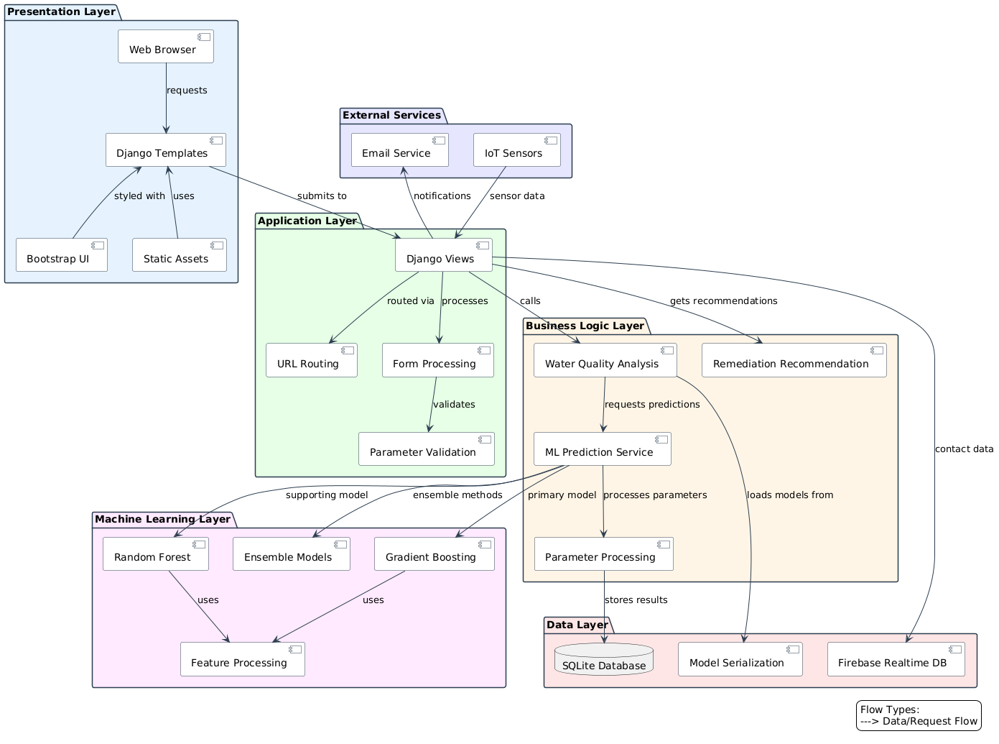

**Project Title: AquaSense AI - Water Quality Analysis Platform**

---

**1. Project Overview**

The "AquaSense AI" is an advanced water quality analysis platform that leverages machine learning to provide accurate assessments and remediation recommendations. The system analyzes multiple water parameters to determine overall water quality, predict missing parameters, and offer both scientific and Ayurvedic remediation guidance. It serves as a comprehensive solution for water quality management, blending traditional knowledge with modern technology.

---

**2. Objective**

The primary objectives of this project are to:
- Enable accurate analysis of water quality through multiple parameters
- Provide real-time monitoring capabilities via IoT integration
- Deliver comprehensive remediation recommendations based on scientific and Ayurvedic approaches
- Create awareness about water quality issues and solutions
- Offer an accessible platform for water quality assessment without specialized equipment

---

**3. Technologies and Tools**

- **Programming Language:** Python 3.8+
- **Backend Framework:** Django 
- **Database:** SQLite (with Firebase integration for contact system)
- **ML Implementation:** 
  - scikit-learn for machine learning models
  - Gradient Boosting Regression, Random Forest, Decision Tree, and other regression models
  - pickle for model serialization
- **Frontend:** HTML, CSS, Bootstrap
- **Data Processing:** pandas, numpy for data manipulation
- **Additional Services:**
  - Firebase Realtime Database for contact management
  - Multi-threading for parallel processing of prediction requests

---

**4. System Requirements**

- **Operating System:** Windows, Linux, or macOS
- **Software:** Python 3.8 or above
- **Network:** Active internet connection for Firebase integration
- **Deployment:** Compatible with Render, Vercel, or similar cloud platforms
- **Browser:** Modern web browser with JavaScript enabled

---

**5. Setup Instructions**

**a. Environment Setup**

1. **Clone the Repository:**
   ```
   git clone https://github.com/Prathameshv07/AquaSense_AI.git
   cd AquaSense_AI
   ```

2. **Create and Activate Virtual Environment:**
   ```
   python -m venv env
   source env/bin/activate  # On Windows: env\Scripts\activate
   ```

3. **Install Dependencies:**
   ```
   pip install -r requirements.txt
   ```

4. **Configure Environment Variables:**
   - Create a `.env` file in the project root with:
     ```
     FIREBASE_CREDENTIALS_JSON=your_firebase_credentials_json
     FIREBASE_DATABASE_URL=your_firebase_database_url
     ```

**b. Database Setup**

The application uses SQLite by default, which requires no additional setup. The database schema will be created automatically when you run migrations:

```
python manage.py migrate
```

**c. Running the Application**

```
python manage.py runserver
```

The application will be available at `http://127.0.0.1:8000/`.

---

**6. Detailed Project Structure**

```
AquaSense_AI/
├── config/                      # Project configuration
│   ├── settings.py              # Django settings
│   ├── urls.py                  # Main URL routing
│   ├── wsgi.py                  # WSGI configuration
│   └── asgi.py                  # ASGI configuration
├── home/                        # Main application
│   ├── templates/               # HTML templates
│   │   ├── home.html            # Landing page
│   │   ├── manual_input.html    # Manual parameter input page
│   │   ├── iot_input.html       # IoT sensor integration page
│   │   ├── auto_suggest.html    # Remediation suggestions page
│   │   ├── suggestions.html     # Knowledge base for solutions
│   │   └── contact.html         # User feedback/contact form
│   ├── views.py                 # View functions and business logic
│   ├── urls.py                  # App-specific URL routing
│   ├── models.py                # Database models
│   └── forms.py                 # Form definitions
├── static/                      # Static assets
│   ├── images/                  # Image resources
│   ├── model/                   # ML model files
│   │   ├── four parameter/      # Models for 4-parameter prediction
│   │   │   ├── GBR_model.pkl    # Gradient Boosting Regressor
│   │   │   ├── RFR_model.pkl    # Random Forest Regressor
│   │   │   └── ...              # Other ML models
│   │   └── eight parameter/     # Models for 8-parameter prediction
│   ├── inputs/                  # Input-related resources
│   ├── suggests/                # Suggestion-related resources
│   └── home/                    # Home page resources
├── staticfiles/                 # Collected static files for production
├── manage.py                    # Django management script
├── requirements.txt             # Python dependencies
└── README.md                    # Project documentation
```

---

**7. Core Components**

- **Water Quality Analysis Module:**  
  Processes multiple water parameters (temperature, dissolved oxygen, pH, conductivity, BOD, nitrate, total coliform) to calculate Water Quality Index (WQI) using ensemble machine learning models.

- **Prediction Engine:**  
  Employs multiple ML models (Gradient Boosting, Random Forest, etc.) to predict missing parameters based on available inputs, enabling comprehensive analysis even with partial data.

- **IoT Integration:**  
  Connects with sensor data for real-time monitoring of key parameters (temperature, pH, dissolved oxygen, conductivity), with API endpoints to receive and process sensor data.

- **Remediation Recommendation System:**  
  Provides tailored suggestions based on parameter values, offering both scientific and Ayurvedic approaches with cross-verification methods.

- **User Interface:**  
  Responsive web interface built with Bootstrap, offering manual input and IoT-based monitoring options with interactive visualization of results.

- **Firebase Contact System:**  
  Secure database for storing user inquiries and feedback, facilitating user support and community engagement.

---

**8. Usage Guide**

**a. Manual Parameter Input:**
1. Navigate to the "Manual Input" section
2. Enter values for available water parameters
3. Submit for analysis
4. View WQI results and parameter-specific remediation recommendations

**b. IoT Integration:**
1. Connect IoT sensors to the platform
2. Navigate to the "IoT Input" section
3. Either upload sensor data or connect live sensors
4. View real-time analysis and recommendations

**c. Accessing Remediation Suggestions:**
1. After analysis, navigate to the "Suggestions" tab
2. View parameter-specific remediation approaches
3. Access educational resources about each parameter
4. Choose between scientific and Ayurvedic remediation options

---

**9. Machine Learning Implementation**

AquaSense AI employs multiple regression models to ensure accurate prediction of water quality parameters:

1. **Gradient Boosting Regressor (Primary Model):** 
   - Used for its high accuracy in predicting non-linear relationships between parameters
   - Implemented using scikit-learn's GradientBoostingRegressor

2. **Supporting Models:**
   - Random Forest Regressor: For robust ensemble-based predictions
   - CatBoost Regressor: Handles categorical features efficiently
   - LightGBM: For fast training and prediction
   - Support Vector Regressor: For complex boundary determination
   - Decision Tree Regressor: For explainable predictions
   - Polynomial Regression: For capturing non-linear relationships

3. **Model Selection:**
   - Models are selected based on the specific parameter being predicted
   - Parallel processing for faster prediction with multiple models

---

**10. Architecture Diagram**

<div style="page-break-inside: avoid;">
  
</div>

**Presentation Layer**

- **Web Browser:** Initiates user interaction with the application.
- **Django Templates:** Dynamically render HTML views for the UI.
- **Bootstrap UI:** Provides responsive styling for frontend components.
- **Static Assets:** Serve CSS, JS, and media files to the browser.

**Application Layer**

- **Django Views:** Handle incoming HTTP requests and coordinate responses.
- **URL Routing:** Maps URLs to their corresponding Django views.
- **Form Processing:** Manages form submission and input handling.
- **Parameter Validation:** Ensures inputs meet predefined criteria.

**Business Logic Layer**

- **Water Quality Analysis:** Evaluates water parameters for quality.
- **ML Prediction Service:** Requests predictions from ML models.
- **Remediation Recommendation:** Suggests corrective actions based on analysis.
- **Parameter Processing:** Structures and cleans input parameters.

**Machine Learning Layer**

- **Gradient Boosting:** Primary model used for prediction tasks.
- **Random Forest:** Secondary model for enhanced prediction.
- **Ensemble Models:** Combines models for improved results.
- **Feature Processing:** Transforms data into model-ready features.

**Data Layer**

- **SQLite Database:** Stores structured application and analysis data.
- **Firebase Realtime DB:** Handles real-time data sync and storage.
- **Model Serialization:** Stores and retrieves trained ML models.

**External Services**

- **IoT Sensors:** Feed real-time sensor data into the system.
- **Email Service:** Sends user notifications and alerts.

**Interaction Flows**

- **Browser → Templates:** Sends requests and receives rendered views.
- **Templates ← Static/Bootstrap:** Loads UI styles and scripts.
- **Templates → Views:** Submits user input to backend logic.
- **Views → URLs/Forms/Validation:** Handles routing and validation.
- **Views → WQA/Remediation:** Triggers analysis and suggestions.
- **WQA → MLService → Models:** Requests predictions from ML layer.
- **MLService → ParamProcess → DB:** Processes and stores results.
- **Views ↔ Firebase:** Manages user or sensor data in real-time.
- **IoT → Views:** Feeds sensor input into analysis workflow.
- **Views → Email:** Sends alerts based on system status.

---

**11. Future Enhancements**

- **Mobile Application:** Development of a companion mobile app for on-the-go water quality monitoring
- **Additional Parameters:** Support for more water quality parameters
- **Enhanced Visualization:** Advanced data visualization tools for better understanding of water quality trends
- **Community Features:** Sharing of water quality data across communities for collaborative monitoring
- **Offline Mode:** Functionality to work without internet connectivity
- **Hardware Integration:** Direct connection with custom hardware sensors
- **API Development:** Public API for third-party integrations

---

**12. Conclusion**

AquaSense AI represents a comprehensive solution for water quality analysis and remediation, combining modern machine learning techniques with traditional knowledge. The platform's ability to process multiple parameters, provide accurate predictions, and offer dual-approach remediation makes it a valuable tool for water quality management. With its user-friendly interface and IoT integration capabilities, it serves both individual users and potential institutional applications in water management.

---

**13. License**

[](http://creativecommons.org/licenses/by-nc/4.0/)

This project is licensed under the **Creative Commons Attribution-NonCommercial 4.0 International License**.  
You are free to **use, share, and adapt** the material for **non-commercial and educational purposes**, as long as proper **credit is given** and any changes are noted.

Learn more: [http://creativecommons.org/licenses/by-nc/4.0/](http://creativecommons.org/licenses/by-nc/4.0/) 